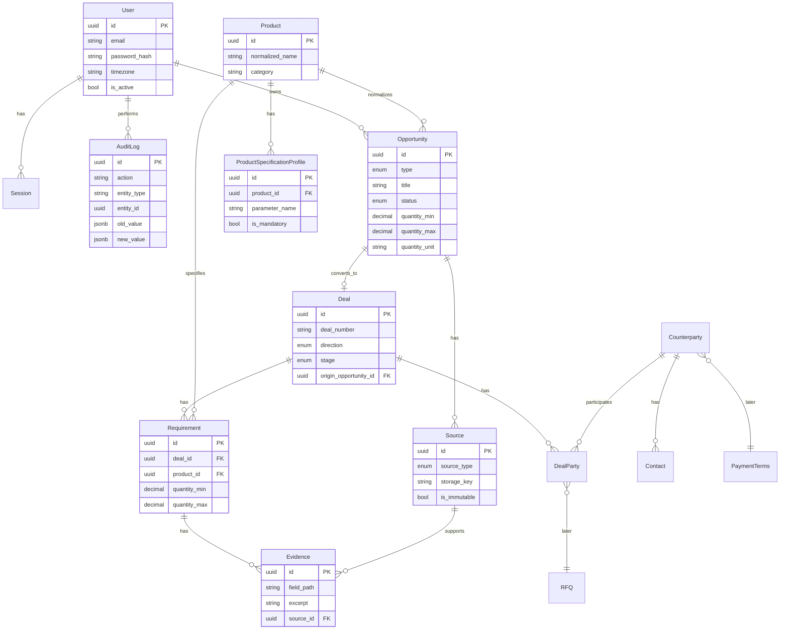

# Architecture

Version: Stage 0 + minimal Stage 1a skeleton  
Based on: PRODUCT_SPEC.md v3.6

## Modular Monolith

```text
┌─────────────────────────────────────────────────────────────┐
│                        Next.js Frontend                      │
│              (Russian UI, cookie credentials)                │
└──────────────────────────┬──────────────────────────────────┘
                           │ HTTP
┌──────────────────────────▼──────────────────────────────────┐
│                     FastAPI Application                      │
│  ┌─────────┐ ┌──────────┐ ┌──────────┐ ┌─────────────────┐ │
│  │   API   │ │ Security │ │ Services │ │  Integrations   │ │
│  │ routes  │ │  auth    │ │ audit    │ │ storage (local) │ │
│  └────┬────┘ └────┬─────┘ └────┬─────┘ └────────┬────────┘ │
│       └───────────┴────────────┴────────────────┘           │
│                         Domain Models                        │
│                    (SQLAlchemy 2 + Pydantic)                   │
└──────────────────────────┬──────────────────────────────────┘
                           │
              ┌────────────┴────────────┐
              │      PostgreSQL         │
              │   (sessions, data)      │
              └─────────────────────────┘
```

### Module boundaries (future-ready)

| Package | Responsibility |
|---------|----------------|
| `api/` | HTTP routes, request/response schemas |
| `domain/` | SQLAlchemy models, enums |
| `security/` | Auth, sessions, password hashing |
| `services/` | Business logic, audit logging |
| `integrations/` | External adapters (storage, email, AI — later) |
| `workflows/` | State machines (later stages) |
| `ai/` | LLM providers (Stage 1b) |
| `calculations/` | Economics engine (Stage 4) |

## Target ER Diagram (full)

Implemented entities marked with ✓.



### Stage 0–1a implemented

- ✓ User, Session, AuditLog
- ✓ Opportunity, Deal, Requirement
- ✓ Source, Evidence
- ✓ Product, ProductSpecificationProfile (seed only)
- ○ Counterparty, Contact, DealParty (Stage 2)
- ○ PaymentTerms (Stage 3)
- ○ RFQ, Message (Stage 2–3)

## Assumptions

1. Single pre-created admin user seeded from environment variables.
2. Cookie-based sessions stored in PostgreSQL; `Secure` flag disabled in local dev.
3. File storage uses local filesystem via `ObjectStorage` interface.
4. Money and quantities use `Decimal` in Python; stored as `NUMERIC` in PostgreSQL.
5. All timestamps are timezone-aware UTC; UI renders in user profile timezone.
6. `Source` records are immutable after creation (no update/delete API).
7. `Opportunity.convert` creates a `Deal` in `QUALIFICATION` stage.
8. PDF is the only upload format on this step; validation by MIME type and extension.
9. Code, API, DB schema in English; UI labels in Russian.
10. CORS allows frontend origin with credentials for cookie auth.

## Consciously NOT implemented (this step)

- AI / LLM extraction (Stage 1b)
- Email integration (Stage 3)
- Monitoring connectors (Stage 6)
- Redis, Celery, pgvector, Playwright
- Counterparty, Contact, RFQ, Approval
- CommercialFact, FulfilmentConfiguration, calculations
- AIBudgetSettings (Stage 1b)
- ResearchCampaign (Stage 1c)
- S3 storage (before cloud pilot)
- Sentry (before email pilot)
- Full Deal workspace UI tabs
- RBAC beyond single admin

## API Endpoints (Stage 0–1a)

| Method | Path | Description |
|--------|------|-------------|
| GET | `/health` | Health check |
| POST | `/auth/login` | Login, set session cookie |
| POST | `/auth/logout` | Logout, clear session |
| GET | `/auth/me` | Current user |
| PATCH | `/auth/me` | Update timezone |
| GET | `/opportunities` | List opportunities |
| POST | `/opportunities` | Create buyer-led opportunity |
| GET | `/opportunities/{id}` | Get opportunity |
| PATCH | `/opportunities/{id}` | Update opportunity |
| POST | `/opportunities/{id}/sources` | Upload PDF source |
| GET | `/opportunities/{id}/sources` | List sources |
| POST | `/opportunities/{id}/convert` | Convert to deal |
| GET | `/deals` | List deals |
| GET | `/deals/{id}` | Get deal |
| POST | `/deals/{id}/requirements` | Create requirement manually |
| GET | `/deals/{id}/requirements` | List requirements |
| PATCH | `/requirements/{id}` | Update requirement |
| GET | `/products` | List products (seed) |
