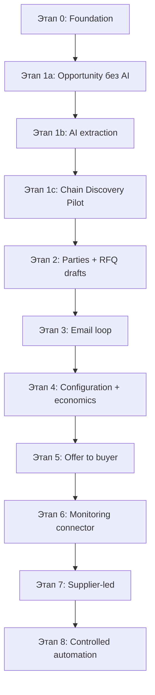

# План разработки

**Проект:** Commodity Agent — полуавтоматический AI-агент для сырьевых сделок  
**Основа:** `commodity_agent_cursor_TZ_v3_6.md` (v3.6)  
**Дата:** 2026-07-12  
**Статус:** готов к старту Этапа 0

---

## 1. Вердикт по готовности

### Можно начинать работу — **ДА**

Версия 3.6 закрывает практически все вопросы из `CLARIFICATIONS_CHECKLIST.md`. Разделы **§26** и **§27** фиксируют решения владельца продукта: auth, инфраструктура, декомпозиция Этапа 1, AI-бюджет, пилотный сценарий, KPI.

### Что остаётся нерешённым (не блокирует Этап 0)

| # | Вопрос | Когда нужен | Статус |
|---|--------|-------------|--------|
| 1 | Mailbox, домен, OAuth credentials | Перед Этапом 3 | Отложено (§27.2) |
| 2 | Юрлицо, бренд, подпись, реквизиты | Перед Этапом 3 | Отложено (§27.2) |
| 3 | Конкретный источник мониторинга (MMTC/RCF/NFL) | После Этапа 5 | Отложено (§26.10) |
| 4 | Web search provider для ResearchCampaign | Перед Этапом 1c | Абстракция задана, провайдер не выбран |
| 5 | Seed-учётные данные admin (email/пароль) | Этап 0 | Допущение: через `.env` |
| 6 | Конкретные имена OpenAI-моделей | Этап 1b | Через конфиг, не hardcode |
| 7 | OpenAI API key | Этап 1b | Операционный секрет |

### Несоответствия в документе (не блокируют, но учесть)

- **§25** всё ещё ссылается на v3.3; актуальная версия — **3.6** (§26–27).
- **§3** описывает buyer-led как главный вертикальный сценарий, а **§27.3** меняет первый пилот на `CHAIN_DISCOVERY_PILOT`. План ниже следует **§27** как более позднему решению владельца.
- Сущность `CompanySettings` упомянута в §27.2, но не описана в доменной модели §7 — добавить в `ARCHITECTURE.md` на Этапе 2.

---

## 2. Архитектурные принципы (зафиксированы)

```text
Modular monolith
  ├── API (FastAPI)
  ├── Domain models (SQLAlchemy 2)
  ├── Workflows (state machines)
  ├── AI (provider abstraction, usage tracking)
  ├── Integrations (email, search, FX, storage)
  ├── Calculations (Decimal, deterministic)
  └── Security (auth, audit, budget gates)

Frontend: Next.js + TypeScript + shadcn/ui
Infra: Docker Compose → VPS
Storage: local FS (этапы 0–2) → S3-compatible (пилот)
CI: GitHub Actions
```

**Ключевые правила:** Evidence first, human approval, LLM ≠ калькулятор, snapshot вместо перезаписи, один этап за раз.

---

## 3. Обновлённая дорожная карта

Порядок этапов с учётом v3.6:



---

## 4. Детальный план по этапам

### Этап 0 — Foundation

**Цель:** приложение запускается, можно войти, данные сохраняются.

**Срок (оценка):** 1–2 недели

#### Backend
- [ ] Scaffold `commodity-agent/` по структуре §18
- [ ] Скопировать ТЗ v3.6 → `PRODUCT_SPEC.md`
- [ ] Создать `ARCHITECTURE.md` с ER-диаграммой (целевая + реализуемая на этапе)
- [ ] PostgreSQL + Alembic migrations
- [ ] Модели: `User`, `AuditLog`
- [ ] Cookie-based auth (`HttpOnly`, `Secure`, `SameSite`)
- [ ] Предсозданный admin через seed/env
- [ ] `ObjectStorage` interface → local filesystem adapter
- [ ] Профиль пользователя: timezone (default `Atlantic/Madeira`)
- [ ] Structured logging
- [ ] GitHub Actions: lint + tests

#### Frontend
- [ ] Next.js scaffold, русский UI
- [ ] Login page
- [ ] Dashboard (заглушка)
- [ ] Settings: timezone
- [ ] Auth middleware

#### Docker
- [ ] `docker-compose.yml`: backend, frontend, postgres
- [ ] Одна команда запуска
- [ ] README с командами

#### Тесты
- [ ] Auth flow (integration)
- [ ] AuditLog на state-changing операциях
- [ ] File upload/read

**Критерий выхода:** §20 Этап 0 + §24 первая задача Cursor.

**Не делать:** AI, email, monitoring, Redis, Celery, pgvector.

---

### Этап 1a — Buyer-led Opportunity (без AI)

**Цель:** ручной ввод возможности и требований с Evidence.

**Срок (оценка):** 1–2 недели  
**Зависит от:** Этап 0

#### Backend
- [ ] Модели: `Opportunity`, `Deal`, `Requirement`, `Source`, `Evidence`, `Product`, `ProductSpecificationProfile`
- [ ] Seed: Product SN500, SN150 (пустые профили — заполнить на 1b/1c)
- [ ] CRUD Opportunity (buyer-led)
- [ ] Загрузка PDF → immutable `Source`
- [ ] Ручное создание `Requirement` из Opportunity
- [ ] `Evidence` с `field_path` для критичных полей
- [ ] `POST /opportunities/{id}/convert` → Deal
- [ ] Статусная модель Opportunity
- [ ] AuditLog на все изменения

#### Frontend
- [ ] Opportunities list + create form
- [ ] Opportunity detail: upload PDF, manual fields
- [ ] Requirement editor с Evidence links
- [ ] Convert to Deal
- [ ] Deals list (read)

#### Тесты
- [ ] Opportunity lifecycle
- [ ] Source immutability
- [ ] Evidence linkage
- [ ] Deal creation from Opportunity

**Критерий выхода:** §26.4 Этап 1a.

---

### Этап 1b — AI Extraction

**Цель:** автоматическое извлечение из документов с контролем бюджета.

**Срок (оценка):** 2–3 недели  
**Зависит от:** Этап 1a

#### Backend
- [ ] `AIBudgetSettings` + `AIUsageLog` (модель, cost, operation, deal_id, document_id)
- [ ] AI provider abstraction (`AIProvider` interface)
- [ ] OpenAI adapter (configurable model names)
- [ ] Budget gates: warnings 75%/90%, hard limit 100%
- [ ] Admin override + disable AI flag
- [ ] Extraction service: PDF (text), DOCX, XLSX
- [ ] Pydantic schemas для structured output
- [ ] Retry + raw response storage + manual review Task
- [ ] `.eml` manual import
- [ ] URL import (публичные static pages only)
- [ ] Caching extracted results

#### Frontend
- [ ] Settings → AI Budget (все поля из §27.1)
- [ ] Dashboard: расходы месяца, остаток, по моделям/операциям
- [ ] Extraction results review UI (confirm/edit per field)
- [ ] Missing fields display

#### Тесты
- [ ] Schema validation failures
- [ ] Budget hard limit blocks calls
- [ ] AuditLog on budget changes
- [ ] Extraction accuracy on synthetic samples

**Критерий выхода:** §26.4 Этап 1b + начало golden set.

**Не делать:** OCR сканов.

---

### Этап 1c — Chain Discovery Pilot

**Цель:** найти рабочую коммерческую цепочку по товару без заранее известной сделки.

**Срок (оценка):** 2–3 недели  
**Зависит от:** Этап 1b

#### Backend
- [ ] Модель `ResearchCampaign` (§27.4)
- [ ] Search provider abstraction (web search)
- [ ] Research service: buyers, suppliers, routes
- [ ] Создание Opportunity из результатов
- [ ] `NO_VIABLE_CHAIN_FOUND` outcome
- [ ] Missing facts report
- [ ] Ручная отметка `SENT_EXTERNALLY`
- [ ] Импорт ответа: `.eml`, PDF, text → CommercialFact (базовый)
- [ ] AI usage tracking per ResearchCampaign

#### Frontend
- [ ] ResearchCampaign create/edit
- [ ] Search results: buyers, suppliers, logistics
- [ ] Export letter / copy text
- [ ] Manual send marker
- [ ] Import response
- [ ] Chain viability dashboard (missing facts, reasons)

#### Seed data
- [ ] ProductSpecificationProfile для SN500/SN150 (dev + trader approval)

#### Тесты
- [ ] ResearchCampaign lifecycle
- [ ] Opportunity creation from campaign
- [ ] Missing facts detection
- [ ] Manual import → CommercialFact

**Критерий выхода:** §27.5 (3 buyers, 3 suppliers, 1 route, 1 imported response, 1 Opportunity).

**Не делать:** автоматическая email-отправка, обещание цены.

---

### Этап 2 — Parties and RFQ Drafts

**Цель:** контрагенты, контакты, черновики RFQ с approval (без отправки).

**Срок (оценка):** 2 недели  
**Зависит от:** Этап 1c

#### Backend
- [ ] `Counterparty`, `Contact`, `DealParty`
- [ ] `CompanySettings` (signature, requisites — schema в ARCHITECTURE.md)
- [ ] Domain verification (DNS/MX + user confirm)
- [ ] `RFQ` со статусной моделью
- [ ] `ApprovalRequest` (draft only, no send)
- [ ] RFQ template library
- [ ] AI drafting (adapt template, not final)
- [ ] Compliance review fields

#### Frontend
- [ ] Counterparties CRUD
- [ ] Deal → Parties tab
- [ ] RFQ builder (type, requested_fields, language)
- [ ] Approval preview (compliance status visible)
- [ ] Template management

#### Тесты
- [ ] RFQ state transitions
- [ ] Approval invalidation on edit
- [ ] Domain verification flow

**Критерий выхода:** §20 Этап 2.

---

### Этап 3 — Email Loop

**Цель:** отправка RFQ и разбор ответов через mailbox.

**Срок (оценка):** 2–3 недели  
**Зависит от:** Этап 2 + **входные данные владельца** (mailbox, домен, бренд)

#### Предварительные требования (§27.2)
- [ ] Выбран mailbox и провайдер (Gmail API / Microsoft Graph)
- [ ] OAuth credentials настроены
- [ ] CompanySettings заполнены (юрлицо, бренд, подпись)
- [ ] Golden set готов (§26.5)

#### Backend
- [ ] Email provider abstraction
- [ ] Gmail / Graph adapters
- [ ] `CommunicationThread`, `Message`
- [ ] Send approved RFQ
- [ ] Sync new messages only
- [ ] `Unlinked Inbox` queue
- [ ] Attachment parsing
- [ ] `SupplyOffer` + `PaymentTerms` extraction
- [ ] `PARTIALLY_ANSWERED` RFQ state
- [ ] `BANK_DETAILS_CHANGED` flag
- [ ] Binding class rules + AI suggestion
- [ ] Sentry подключение

#### Frontend
- [ ] Inbox + Unlinked Inbox
- [ ] Message link to Deal/RFQ
- [ ] Approval send screen (full checklist §9.3)
- [ ] Quote review UI

#### Тесты
- [ ] Golden set: 100% на price/currency/quantity/Incoterm
- [ ] RFQ partial answer
- [ ] Bank details change blocking

**Критерий выхода:** §20 Этап 3.

---

### Этап 4 — Configuration and Economics

**Цель:** варианты поставки, landed cost, маржа, cash-flow.

**Срок (оценка):** 3–4 недели  
**Зависит от:** Этап 3

#### Backend
- [ ] `FulfilmentConfiguration`, `ShipmentLot`, `TransportLeg`, `ServiceQuote`
- [ ] `CommercialFact` versioning
- [ ] Calculation engine (Decimal)
- [ ] Cost model §10.2
- [ ] Cash-flow financing по PaymentMilestone
- [ ] FX: ECB reference rate + manual override
- [ ] Customs: manual input with Evidence
- [ ] Incoterms 2020 (all in model, 8 in UI)
- [ ] Unit normalization (MT, kg, bbl, US gallon)
- [ ] STALE propagation
- [ ] Scenarios: CURRENT + CONFIRMED
- [ ] Spec matcher (MATCH / TOLERANCE / MISMATCH / UNKNOWN)
- [ ] Sensitivity (price, freight, FX, payment delay, demurrage)

#### Frontend
- [ ] Configuration builder
- [ ] Comparison table §16
- [ ] Economics tab (CURRENT / CONFIRMED)
- [ ] Stale inputs warnings
- [ ] `health_status` display

#### Тесты
- [ ] Calculation unit tests (critical paths)
- [ ] STALE propagation tests
- [ ] Spec matching tests
- [ ] FX snapshot tests

**Критерий выхода:** §20 Этап 4 + golden set threshold.

---

### Этап 5 — Offer to Buyer

**Цель:** коммерческое предложение с approval.

**Срок (оценка):** 1–2 недели  
**Зависит от:** Этап 4

#### Backend
- [ ] Offer generation from configuration snapshot
- [ ] Email HTML/plain format
- [ ] Optional PDF from template
- [ ] `DealParty.disclosure_status` enforcement
- [ ] Approval with exact payload
- [ ] Send via email or manual export

#### Frontend
- [ ] Offer preview (estimate/confirmed/expired)
- [ ] Disclosure controls
- [ ] Approval screen
- [ ] Send / export

**Критерий выхода:** §20 Этап 5 + §26.9.

---

### Этап 6 — First Monitoring Connector

**Цель:** один источник → Opportunities без дублей.

**Срок (оценка):** 2 недели  
**Зависит от:** Этап 5 + выбор источника

#### Предварительные требования
- [ ] Источник выбран и ToS/robots.txt проверены
- [ ] S3-compatible storage для production

#### Backend
- [ ] `MonitoringRule`, connector framework
- [ ] Healthcheck
- [ ] Polling (daily)
- [ ] Raw snapshot + content_hash
- [ ] Deduplication
- [ ] Opportunity creation with filters
- [ ] APScheduler integration

**Критерий выхода:** §20 Этап 6.

---

### Этап 7 — Supplier-led Scenario

**Срок (оценка):** 2 недели  
**Зависит от:** Этап 6

- [x] Supplier-led Opportunity flow
- [x] SupplyOffer ↔ buyer needs matching
- [x] Market comparison
- [x] Buyer outreach drafts

**Критерий выхода:** §20 Этап 7.

---

### Этап 8 — Controlled Automation

**Срок (оценка):** 1–2 недели  
**Зависит от:** успешный ручной пилот

- [x] Auto follow-up (NON_BINDING only)
- [x] Rate limits
- [x] BINDING actions always require approval
- [x] Full audit trail

**Критерий выхода:** §20 Этап 8.

---

## 5. Сводная таблица сроков

| Этап | Название | Оценка | Кумулятивно |
|------|----------|--------|-------------|
| 0 | Foundation | 1–2 нед | 1–2 нед |
| 1a | Opportunity без AI | 1–2 нед | 2–4 нед |
| 1b | AI extraction | 2–3 нед | 4–7 нед |
| 1c | Chain Discovery Pilot | 2–3 нед | 6–10 нед |
| 2 | Parties + RFQ | 2 нед | 8–12 нед |
| 3 | Email loop | 2–3 нед | 10–15 нед |
| 4 | Economics | 3–4 нед | 13–19 нед |
| 5 | Offer | 1–2 нед | 14–21 нед |
| 6 | Monitoring | 2 нед | 16–23 нед |
| 7 | Supplier-led | 2 нед | 18–25 нед |
| 8 | Automation | 1–2 нед | 19–27 нед |

**MVP (этапы 0–5 + пилот):** ~14–21 неделя (3.5–5 месяцев) при одном разработчике.

---

## 6. Пилотный сценарий CHAIN_DISCOVERY_PILOT

Первый end-to-end тест (§27.3):

```text
SN500/SN150 + заданная география
  → ResearchCampaign
  → поиск buyer needs + suppliers + маршрут
  → Opportunities
  → RFQ drafts (ручная отправка / export)
  → импорт ответов
  → CommercialFacts с Evidence
  → FulfilmentConfiguration (или NO_VIABLE_CHAIN_FOUND)
  → расчёт экономики
  → решение: перспективна / нет (с причинами)
```

**Успех пилота (§27.6):** не прибыльная сделка, а корректный исследовательский цикл с Evidence и объяснимым результатом.

---

## 7. Ключевые сущности по этапам

| Этап | Новые сущности |
|------|----------------|
| 0 | User, AuditLog |
| 1a | Opportunity, Deal, Requirement, Source, Evidence, Product, ProductSpecificationProfile |
| 1b | AIBudgetSettings, AIUsageLog |
| 1c | ResearchCampaign, CommercialFact (базовый) |
| 2 | Counterparty, Contact, DealParty, RFQ, ApprovalRequest, CompanySettings |
| 3 | CommunicationThread, Message, SupplyOffer, PaymentTerms |
| 4 | FulfilmentConfiguration, ShipmentLot, TransportLeg, ServiceQuote |
| 5 | Offer (snapshot) |
| 6 | MonitoringRule, MonitoringRun |
| 7 | — (переиспользование) |
| 8 | AutomationRule |

---

## 8. Риски и митигация

| Риск | Этап | Митигация |
|------|------|-----------|
| Преждевременное усложнение схемы | 0 | Реализовать только сущности текущего этапа |
| Низкое качество AI extraction | 1b | Golden set, manual review, budget limits |
| Chain Discovery без результатов | 1c | `NO_VIABLE_CHAIN_FOUND` — валидный исход |
| Нет mailbox к Этапу 3 | 3 | Ручной export/import уже на 1c |
| Ошибки в расчётах | 4 | Decimal, unit tests, STALE propagation |
| Превышение AI-бюджета | 1b+ | Hard limit 100 USD, caching, cost-efficient models |
| Изменение структуры monitoring source | 6 | Healthcheck, raw snapshots, graceful degradation |

---

## 9. Первые шаги (немедленно)

1. Скопировать `commodity_agent_cursor_TZ_v3_6.md` → `PRODUCT_SPEC.md`
2. Инициализировать репозиторий `commodity-agent/` по §18
3. Создать `ARCHITECTURE.md` с ER-диаграммой
4. Реализовать Этап 0 по §24
5. Зафиксировать admin credentials в `.env.example`
6. Настроить GitHub Actions

---

## 10. Контрольные точки (milestones)

| Milestone | Этап | Что демонстрируем |
|-----------|------|-------------------|
| **M0: Boot** | 0 | Login, file upload, audit |
| **M1: Manual deal** | 1a | Opportunity → Requirement → Deal вручную |
| **M2: AI assist** | 1b | PDF extraction + budget dashboard |
| **M3: Discovery** | 1c | ResearchCampaign → chain report |
| **M4: RFQ ready** | 2 | RFQ drafts + approval preview |
| **M5: Email live** | 3 | Send RFQ, parse response |
| **M6: Economics** | 4 | Landed cost, margin, comparison |
| **M7: MVP complete** | 5 | Offer with approval |
| **M8: Monitoring** | 6 | Auto Opportunities from source |

---

*План основан на PRODUCT_SPEC v3.6. Обновлять при изменении scope или решений владельца продукта.*
